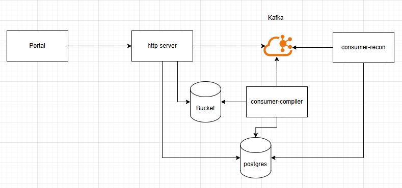
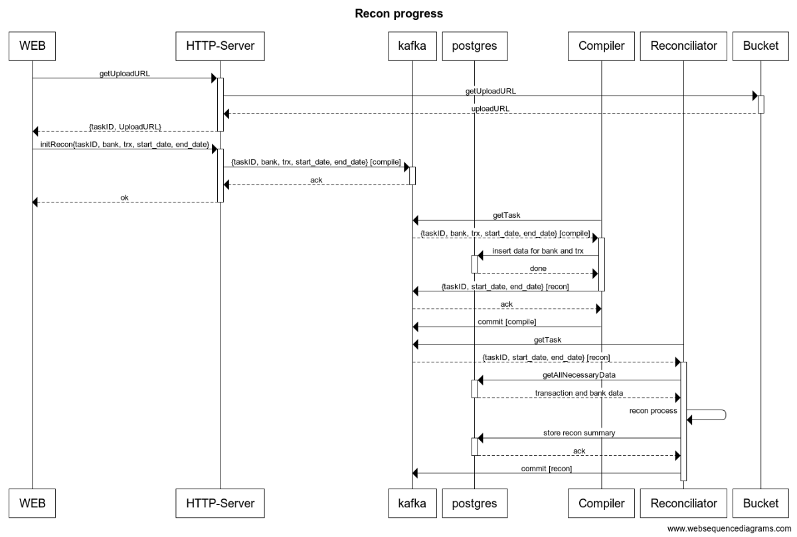

# YARS - Yet Another Reconciliation System

YARS is a financial reconciliation system for comparing internal transaction records with bank statements to identify discrepancies, reconcile transactions, and generate reports.

## Overview

This system helps finance teams match internal transaction records with bank statements, identify mismatches, and analyze discrepancies. It provides a web UI for uploading transaction files, viewing summaries, and exploring unmatched transactions.

## Architecture

YARS uses a microservices architecture with the following components:

- **API Server**: Handles HTTP requests, file uploads, and serves the web UI
- **Compiler Service**: Processes uploaded CSV files and stores transactions in the database
- **Reconciliation Service**: Matches internal transactions with bank statements
- **PostgreSQL**: Stores transaction data, bank statements, and reconciliation results
- **Google Cloud Storage**: Stores uploaded files
- **Kafka**: Handles event-driven communication between services





## Prerequisites

- Docker and Docker Compose
- Git
- Modern web browser
- 4GB+ RAM available for Docker

## Installation

1. Clone the repository:

```bash
git clone https://github.com/aferryc/yars.git
cd yars
```

2. Set up environment variables (optional - defaults are provided):

```bash
cp .env.example .env
# Edit .env with your preferred settings
```

## Running with Docker

1. Start all services:

```
make setup-fresh
```

This will start:

PostgreSQL database
GCS emulator (fake-gcs-server)
Zookeeper and Kafka
API Server
Compiler Consumer
Reconciliation Consumer

2. Access the web UI at: http://localhost:8080

## Usage Guide

Uploading Transaction Files

1. Go to http://localhost:8080
2. Click on the "Upload" tab
3. Select your transaction file and bank statement file (CSV format)
4. Click "Upload" for each file
5. Enter bank name and optionally select date range
6. Click "Start Compilation"

## CSV File Format

Transaction file format:

```
id,amount,type,transaction_time
tx123,100.50,CREDIT,2023-01-15T14:30:45Z
tx456,200.75,DEBIT,2023-01-16T10:20:30Z
```

Bank statement file format:

```
id,amount,date
bs-101,500.25,2023-01-15
bs-102,750.50,2023-01-16
```

## Viewing Results

1. Go to the "Summaries" tab to see reconciliation results
2. Click "View Details" on any summary to see matched and unmatched transactions

## API Endpoints

- GET /api/reconciliation/upload - Get URLs for file uploads
- POST /api/reconciliation - Start reconciliation process
- GET /api/reconciliation/summaries - Get reconciliation summaries
- GET /api/reconciliation/summary/:id - Get details for a specific summary

## Database Schema

The system uses the following main tables:

- transactions: Stores internal transaction records
- bank_statements: Stores bank statement entries
- recon_summary: Stores reconciliation results
- unmatched_transactions: Stores transactions without a bank match
- unmatched_bank_statements: Stores bank entries without a transaction match

License
MIT License
